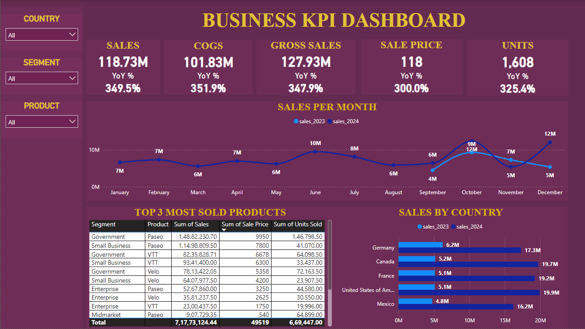

# Power BI Business Analytics Dashboard

## Overview

Welcome to my Power BI project showcasing a comprehensive analytics dashboard for a business company operating in Europe and Western countries. This project is designed to demonstrate data visualization and business intelligence capabilities using Power BI.

## Project Description

This Power BI dashboard provides a deep dive into the financial and operational aspects of the company, with key metrics including:

- **Units Sold:** Track the total number of units sold across different regions and time periods.
- **Sales Per Segment:** Analyze sales performance segmented by various categories such as product type, region, or customer demographics.
- **Top 3 Products by Sales:** Identify the top three products with the highest sales within each segment to understand key revenue drivers.
- **Price Per Unit:** Monitor pricing trends and average price per unit for different products and segments.

## Dashboard Preview

Here is a snapshot of the dashboard:

## Key Features

- **Interactive Dashboards:** Engage with real-time data through interactive charts, maps, and graphs to explore key financial metrics.
- **Sales Analysis:** Visualize sales data to understand performance across different segments and regions.
- **Product Performance:** Identify top-performing products and analyze their contribution to overall sales.
- **Pricing Insights:** Track and analyze pricing trends to make informed pricing decisions.

## Impact on Business Management

The insights provided by this Power BI dashboard have a significant impact on business management:

- **Informed Decision-Making:** By offering detailed views of sales performance, units sold, and pricing trends, managers can make data-driven decisions to enhance sales strategies and pricing policies.
- **Sales Optimization:** Analyzing sales per segment and identifying top products helps focus marketing and sales efforts on high-performing areas and products.
- **Operational Efficiency:** Understanding the relationship between units sold and price per unit assists in optimizing inventory and production processes.
- **Strategic Planning:** Detailed sales data and product performance metrics support long-term planning, forecasting, and strategic decision-making.

## Technologies Used

- **Power BI Desktop:** For creating and designing interactive reports and dashboards.
- **Power Query:** For data extraction, transformation, and loading (ETL).
- **DAX (Data Analysis Expressions):** For advanced calculations and data modeling.

## Getting Started

To explore the dashboard, clone this repository and open the Power BI file (.pbix) using Power BI Desktop. For detailed instructions on navigating the dashboard and interpreting the data, refer to the documentation provided within the project.

## Contact

For any questions or feedback, feel free to reach out via mail: umeaimanyusuf@usf.edu.
